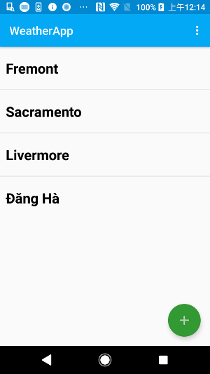
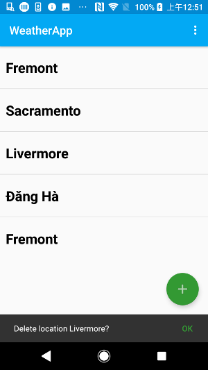
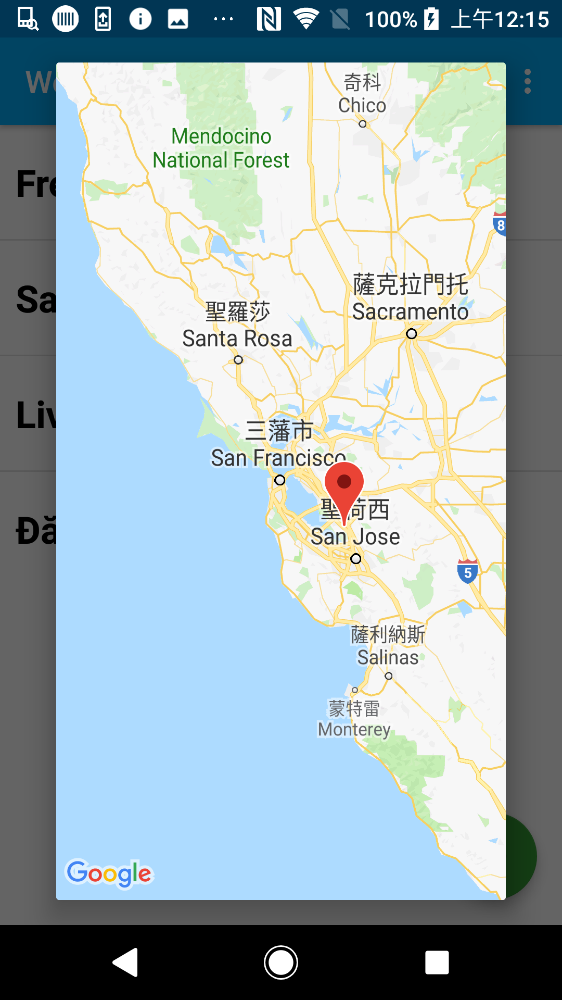
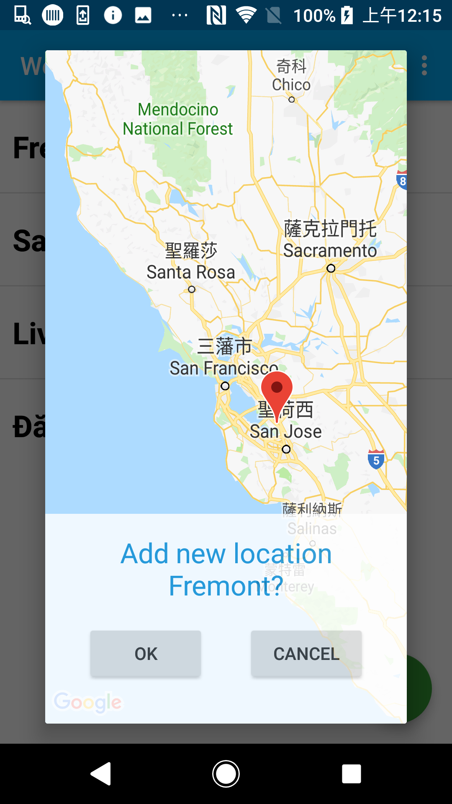
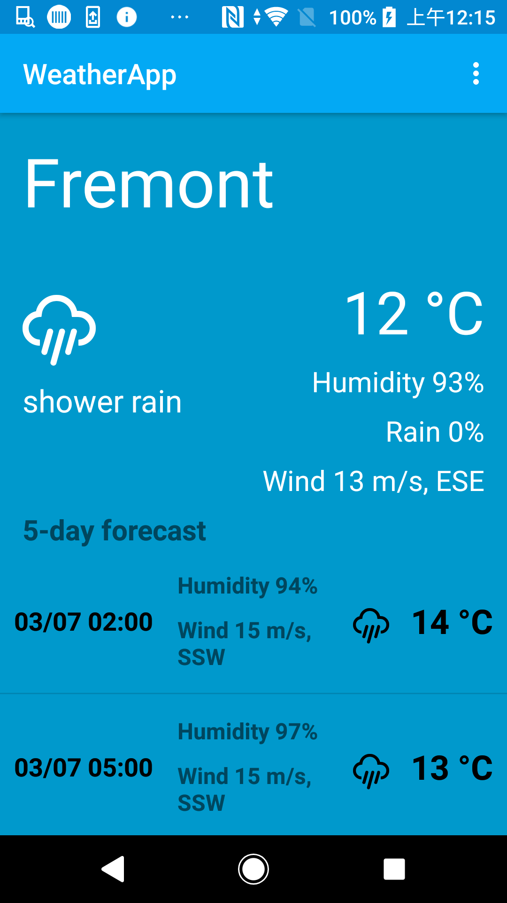
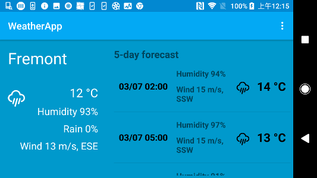
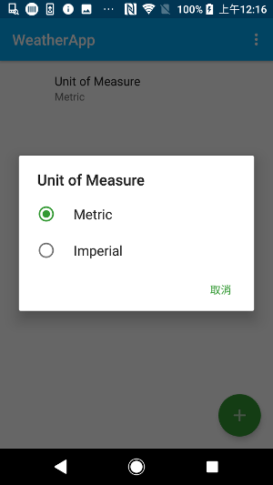
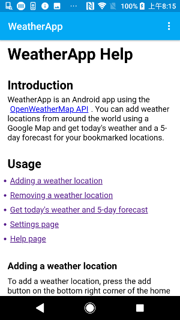

# WeatherApp
Weather Android app

## Table of contents
* [Introduction](#introduction)
* [Features](#features)
* [Screenshots](#screenshots)
* [Contact](#contact)

## Introduction
Weather Android app using the OpenWeatherMap API (​http://openweathermap.org/api)

## Features
List of features:
* Show a list of bookmarked locations
* Add locations by placing a pin on map
* Delete locations from the list by long press
* Show today's forecast for a location
* Show 5-day forecast for a location
* Help screen
* Settings page

## Screenshots

## Contact
Created by Kevin Phua (kmphua@gmail.com)